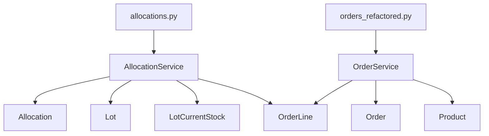

# ロット管理システム v2.0 - バックエンド

## 概要

材料在庫をロット単位で一元管理し、OCR で読み取った受注に対して正しいロットを引き当て、在庫不足時には自動で仮発注を起票するシステムのバックエンド API です。

## 主な特徴

- **イベントソーシング型在庫管理**: `stock_movements`テーブルで全在庫変動を記録
- **パフォーマンス最適化**: `lot_current_stock`サマリテーブルで高速在庫参照
- **FEFO 対応**: 有効期限が近いロットから優先的に引当
- **単位換算対応**: 製品ごとの単位換算テーブル
- **トランザクション保証**: 入荷・引当・出荷の整合性を保証

## 技術スタック

- **Framework**: FastAPI 0.115.5
- **ORM**: SQLAlchemy 2.0.36
- **Database**: SQLite (開発), PostgreSQL/MySQL (本番想定)
- **Validation**: Pydantic 2.10.1
- **Server**: Uvicorn 0.32.0

## ディレクトリ構造

```
backend/
├── app/
│   ├── __init__.py
│   ├── main.py              # FastAPIアプリケーション
│   ├── core/
│   │   ├── config.py        # 設定管理
│   │   └── database.py      # DB接続
│   ├── models/
│   │   ├── base_model.py    # SQLAlchemy Base
│   │   ├── masters.py       # マスタモデル
│   │   ├── inventory.py     # 在庫モデル
│   │   ├── sales.py         # 販売モデル
│   │   └── logs.py          # ログモデル
│   ├── schemas/
│   │   ├── base.py          # 基底スキーマ
│   │   ├── masters.py       # マスタスキーマ
│   │   ├── inventory.py     # 在庫スキーマ
│   │   ├── sales.py         # 販売スキーマ
│   │   └── integration.py   # 連携スキーマ
│   └── api/
│       ├── deps.py          # 依存性注入
│       └── routes/
│           ├── masters.py   # マスタAPI
│           ├── lots.py      # ロットAPI
│           ├── receipts.py  # 入荷API
│           ├── orders.py    # 受注API
│           ├── integration.py # 連携API
│           └── admin.py     # 管理API
├── requirements.txt
├── .env.example
└── README.md
```

## セットアップ

### 1. 依存関係のインストール

```bash
cd backend
pip install -r requirements.txt
```

### 2. 環境変数の設定

```bash
cp .env.example .env
# 必要に応じて .env を編集
```

### 3. アプリケーションの起動

```bash
# 開発サーバー起動
uvicorn app.main:app --reload

# または
python -m app.main
```

アプリケーションは http://localhost:8000 で起動します。

## API ドキュメント

- **Swagger UI**: http://localhost:8000/api/docs
- **ReDoc**: http://localhost:8000/api/redoc

## 主要エンドポイント

### マスタ管理

- `GET /api/masters/warehouses` - 倉庫一覧
- `GET /api/masters/suppliers` - 仕入先一覧
- `GET /api/masters/customers` - 得意先一覧
- `GET /api/masters/products` - 製品一覧

### ロット・在庫管理

- `GET /api/lots` - ロット一覧(在庫付き)
- `POST /api/lots` - ロット登録
- `POST /api/lots/movements` - 在庫変動記録

### 入荷管理

- `GET /api/receipts` - 入荷伝票一覧
- `POST /api/receipts` - 入荷伝票作成(一括)

### 受注管理

- `GET /api/orders` - 受注一覧
- `GET /api/orders/{order_id}` - 受注詳細
- `POST /api/orders/allocations/drag-assign` - ドラッグ引当

### OCR・SAP 連携

- `POST /api/integration/ai-ocr/submit` - OCR 受注取込
- `POST /api/integration/sap/register` - SAP 送信
- `GET /api/integration/sap/logs` - SAP 連携ログ

### 管理機能

- `GET /api/admin/health` - ヘルスチェック
- `POST /api/admin/reset-database` - DB リセット(開発のみ)
- `POST /api/admin/init-sample-data` - サンプルデータ投入

## データベーススキーマ

### テーブル構成 (15 テーブル + 1 サマリテーブル)

**マスタ**

- `warehouses` - 倉庫
- `suppliers` - 仕入先
- `customers` - 得意先
- `products` - 製品
- `product_uom_conversions` - 単位換算

**在庫**

- `lots` - ロット
- `stock_movements` - 在庫変動履歴(イベントソーシング)
- `lot_current_stock` - 現在在庫(サマリ)
- `receipt_headers` - 入荷伝票ヘッダ
- `receipt_lines` - 入荷伝票明細
- `expiry_rules` - 有効期限ルール

**販売**

- `orders` - 受注ヘッダ
- `order_lines` - 受注明細
- `allocations` - 引当
- `shipping` - 出荷
- `purchase_requests` - 仮発注

**ログ**

- `ocr_submissions` - OCR 取込ログ
- `sap_sync_logs` - SAP 連携ログ

## 使用例

### ロット登録

```bash
curl -X POST "http://localhost:8000/api/lots" \
  -H "Content-Type: application/json" \
  -d '{
    "supplier_code": "SUP001",
    "product_code": "PRD-001",
    "lot_number": "LOT-2024-001",
    "receipt_date": "2024-11-01",
    "expiry_date": "2025-11-01",
    "warehouse_code": "WH001"
  }'
```

### 入荷登録(在庫増加)

```bash
curl -X POST "http://localhost:8000/api/lots/movements" \
  -H "Content-Type: application/json" \
  -d '{
    "lot_id": 1,
    "movement_type": "receipt",
    "quantity": 100.0,
    "related_id": "receipt_1"
  }'
```

### ドラッグ引当

```bash
curl -X POST "http://localhost:8000/api/orders/allocations/drag-assign" \
  -H "Content-Type: application/json" \
  -d '{
    "order_line_id": 1,
    "lot_id": 1,
    "allocate_qty": 50.0
  }'
```

## 開発 Tips

### データベースリセット

```bash
curl -X POST "http://localhost:8000/api/admin/reset-database"
```

### サンプルデータ投入

```bash
curl -X POST "http://localhost:8000/api/admin/init-sample-data"
```

## トラブルシューティング

### モジュールが見つからないエラー

```bash
export PYTHONPATH="${PYTHONPATH}:$(pwd)"
```

### データベースロック

SQLite のロックが発生した場合:

```bash
rm lot_management.db
# アプリを再起動すると自動で再作成されます
```

## 今後の拡張

- [ ] 認証・認可(JWT)
- [ ] WebSocket(リアルタイム在庫更新)
- [ ] ファイルアップロード(検査成績書)
- [ ] バックグラウンドジョブ(期限アラート)
- [ ] PostgreSQL/MySQL 対応
- [ ] Docker 対応

## ライセンス

MIT License


---

## アーキテクチャ概要

本バックエンドは、**3層構造（API層 / Service層 / Model層）**で責務分離されています。  
API（FastAPIルーター）はI/O整形と例外ハンドリング、ServiceはユースケースとTx境界管理、ModelはSQLAlchemy ORMを担います。

```
API Layer (FastAPI Routers)
     ↓
Service Layer (Business Logic)
     ↓
Model Layer (SQLAlchemy ORM)
```

## 依存関係マップ（Mermaid）

下記は主要ルーターとサービス・モデルの依存関係を示す概要図です。  
完全版は [`docs/architecture/api_service_model.mmd`](docs/architecture/api_service_model.mmd) を参照してください。



> ルーターの統一（prefix/tags整備）、ordersの一本化、allocationsのURL整合修正は、**既存API仕様を変更せず**に実施しています。

## テスト状況

- ✅ `pytest`：**25件 PASS**（既存API入出力・丸め・状態遷移の回帰確認を含む）
- ⚠️ 警告（将来のメンテ性向上のため任意対応）
  - `declarative_base()` → `sqlalchemy.orm.declarative_base()` 置換
  - Pydantic v2: `class Config` → `model_config = ConfigDict(...)`
  - `transaction already deassociated...`：fixture内 `rollback()` 順序の見直し（挙動への影響なし）

## 今後のドキュメント整備（TODO）
- ER図（`docs/architecture/er_model.mmd`）
- シーケンス図（例：受注→引当→出荷）
- ロギングポリシーとルーター命名規約
