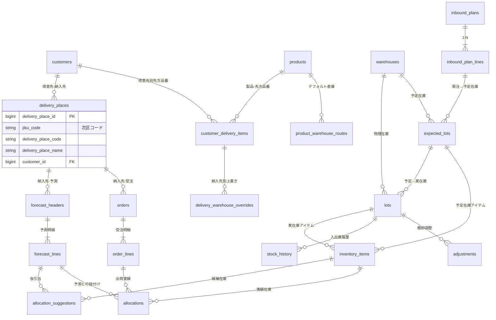

# ロット管理システム 概要設計書 v2.1

## 1. ドキュメント概要

本ドキュメントは、これまでの v1 設計書群（ChatGPT / Claude / Gemini）と ER 図レビュー結果を統合し、最新の議論内容と実運用前提を反映した **v2.1 概要設計** を示す。

- 対象：ロット管理システム全体の **業務フロー / データモデル / テーブル役割**
- 目的：
  - 業務担当者との共通認識のベース
  - 実装（FastAPI + PostgreSQL + React）時の参照設計
  - 今後の拡張・リファクタリング方針の基準

本書は「実装コードとの完全一致」よりも、まず **概念レベルの一貫性と拡張性** を優先する。

---

## 2. 前提・設計方針（v2.1 での確定事項）

### 2.1 業務方針

- **入庫は厳しく・出荷は緩く**
  - 入庫は社内メンバーがロット番号・数量・期限・倉庫を厳密に登録
  - 出荷は倉庫判断を優先し、システムは「推奨」と「実績」を別テーブルで保持
- **入荷予定と実在庫は分離**
  - 発注明細：`inbound_plan_lines`
  - 日付付き予定在庫：`expected_lots`
  - 確定した実在庫：`lots`
- **引当（suggestion）と実績（allocation）を分ける**
  - 推奨：`allocation_suggestions`（フォーキャスト起点）
  - 実績：`allocations`（受注起点）
- **差異は発生する前提で、後から調整可能な構造**
  - 在庫移動履歴：`stock_history`
  - 差異調整：`adjustments`

### 2.2 データモデル方針（v2.1 で追加・変更）

#### 方針A：在庫の抽象化（inventory_items）

実在庫(`lots`)と予定在庫(`expected_lots`)を **`inventory_items`** で一段抽象化し、  
引当・実績はこのテーブルのみ参照する。

- `allocation_suggestions.inventory_item_id`
- `allocations.inventory_item_id`

→ ポリモーフィック FK（lot or expected_lot）を隠蔽し、クエリと制約をシンプルにする。

#### 方針B：出庫ルートの 2 分割

出荷元の決定ロジックを明示化するため、**製品デフォルト** と **納入先別上書き** を分離。

- `product_warehouse_routes`：製品ごとのデフォルト倉庫ルート
- `delivery_warehouse_overrides`：納入先＋先方品番単位での倉庫上書き

#### 方針C：倉庫は 1 テーブル + タイプで表現

- `warehouses` テーブルに集約
  - 自社倉庫 / 外部倉庫の区別は `warehouse_type` で管理（`internal` / `external` / `supplier` 等）
  - 今は「出荷元倉庫」として一括りにし、将来ロケーションやロケーション階層を追加可能にする。

#### 方針D：配送先 × 製品 × 出荷元（C パターン）でルート管理

- SAP の品番マスタでは「製品 × 納品先」に対して出荷元倉庫が紐づいていた想定
- v2.1 では、柔軟性を優先し **「得意先・納入先・先方品番（customer_delivery_item） × 倉庫」** で上書きルート管理を行う
- 「配送先と出荷元は基本固定」だが、例外ケースは上書きテーブルで扱う

---

## 3. 全体 ER 概要（ブロック構成）

### 3.1 論理ブロック

1. **マスタ系**
   - customers, delivery_places, warehouses, products, suppliers
2. **品番マッピング・先方品番**
   - customer_delivery_items（得意先＋納入先＋先方品番＋製品）
3. **入荷・在庫・抽象在庫**
   - inbound_plans, inbound_plan_lines, expected_lots, lots, inventory_items
4. **フォーキャスト・引当候補**
   - forecast_headers, forecast_lines, allocation_suggestions
5. **受注・引当実績・出荷**
   - orders, order_lines, allocations, stock_history, adjustments
6. **出荷ルート**
   - product_warehouse_routes, delivery_warehouse_overrides

### 3.2 ER 図（v2.1 概要）

> ※概念レベルの簡略図。物理カラムは後続節で説明。

------

## 4. テーブルグループ別の詳細設計

### 4.1 マスタ系

#### 4.1.1 customers（得意先マスタ）

- 役割：得意先単位の管理（請求先レベル）
- 主なカラム
  - `customer_id` PK
  - `customer_code`：社内得意先コード
  - `customer_name`
  - `created_at`, `updated_at`
- 関連
  - `delivery_places`（納入先）
  - `customer_delivery_items`（得意先＋納入先＋先方品番）

#### 4.1.2 delivery_places（納入先マスタ）

- 役割：SAP の「次区（jiku）」・納入先コードを扱うマスタ
- 主なカラム
  - `delivery_place_id` PK
  - `jiku_code`：SAP「次区」。カラム名は実運用に合わせて `jiku_code` とする
  - `delivery_place_code`：社内/表示用納入先コード
  - `delivery_place_name`
  - `customer_id` FK
  - `created_at`, `updated_at`
- 関連
  - `orders`（受注）
  - `forecast_headers`（フォーキャスト）
  - `customer_delivery_items`

#### 4.1.3 warehouses（倉庫マスタ）

- 役割：自社倉庫・外部倉庫を含む出荷元・保管拠点
- 主なカラム
  - `warehouse_id` PK
  - `warehouse_code`
  - `warehouse_name`
  - `warehouse_type`：`internal` / `external` / `supplier` など（将来の拡張も考慮）
  - `created_at`, `updated_at`
- 関連
  - `lots`, `expected_lots`
  - `product_warehouse_routes`, `delivery_warehouse_overrides`（経由で出荷元として利用）

#### 4.1.4 products（製品マスタ）

- 役割：製品単位の基本情報
- 主なカラム
  - `product_id` PK
  - `maker_part_code`：メーカー品番
  - `product_name`
  - `base_unit`：社内在庫単位（個 / 本 / kg など）
  - `consumption_limit_days`：消費期限日数（FEFO 用）
  - `created_at`, `updated_at`
- 関連
  - `inbound_plan_lines`, `expected_lots`, `lots`
  - `product_warehouse_routes`
  - `customer_delivery_items`

#### 4.1.5 suppliers（仕入先マスタ）

- 役割：仕入先情報
- 主なカラム
  - `supplier_id` PK
  - `supplier_code`
  - `supplier_name`
  - `created_at`, `updated_at`
- 関連
  - `inbound_plans`

------

### 4.2 品番マッピング・先方品番

#### 4.2.1 customer_delivery_items（得意先別先方品番マスタ）

**「得意先コード × 納入先（jiku）× 先方品番 × 製品 × 出荷元候補」** の中核テーブル。

- 役割：
  - 先方品番と自社製品（`product_id`）を結びつける
  - 単位換算情報や組付区など、SAP マスタ相当の情報を保持
- 主なカラム
  - `customer_delivery_item_id` PK
  - `customer_id` FK
  - `delivery_place_id` FK
  - `external_product_code`：先方品番
  - `product_id` FK
  - `base_unit`：社内在庫単位
  - `order_unit`：先方注文単位
  - `conv_numerator`：変換分子
  - `conv_denominator`：変換分母
  - `created_at`, `updated_at`
- 補足：
  - 単位換算：`base_qty = order_qty * conv_numerator / conv_denominator`
- 関連
  - `delivery_warehouse_overrides`：この単位で出荷元倉庫の上書き設定を行う

------

### 4.3 入荷・在庫テーブル

#### 4.3.1 inbound_plans / inbound_plan_lines

- **inbound_plans**（発注ヘッダ）
  - 役割：仕入先への発注書ヘッダ情報
  - 主なカラム
    - `inbound_plan_id` PK
    - `supplier_id` FK
    - `po_number`：発注番号
    - `order_date`：発注日
    - `planned_delivery_date`：基準納期
    - `status`：`ordered` / `confirmed` / `partial` / `completed` / `cancelled`
    - `created_at`, `updated_at`

- **inbound_plan_lines**（発注明細）
  - 役割：発注書の明細行（製品×数量）
  - 主なカラム
    - `inbound_plan_line_id` PK
    - `inbound_plan_id` FK
    - `product_id` FK
    - `ordered_quantity`：発注数量
    - `planned_delivery_date`：明細別納期
    - `status`：`pending` / `scheduled` / `partial` / `arrived` / `cancelled`
    - `created_at`, `updated_at`

#### 4.3.2 expected_lots（予定在庫）

- 役割：
  - 日付 × 製品 × 倉庫粒度で「予定在庫」を表現
  - ロット番号が未確定の段階での在庫予定
- 主なカラム
  - `expected_lot_id` PK
  - `inbound_plan_line_id` FK（元の発注明細）
  - `product_id` FK
  - `warehouse_id` FK
  - `expected_date`：入庫予定日
  - `expected_quantity`：予定数量
  - `status`：`planned` / `part_arrived` / `completed` / `cancelled`
  - `created_at`, `updated_at`
- 補足：
  - 1つの発注明細が複数日に分納される場合、複数の `expected_lots` が作られる
  - 入荷実績は `lots` として記録され、`expected_lot_id` で紐付けられる

#### 4.3.3 lots（実在庫）

- 役割：
  - ロット番号確定済みの「実在庫」
  - FEFO管理の中心テーブル
- 主なカラム
  - `lot_id` PK
  - `product_id` FK
  - `warehouse_id` FK
  - `lot_number`：ロット番号
  - `quantity`：現在庫数量
  - `allocated_quantity`：引当済数量（オプション、計算カラムとしても可）
  - `expiry_date`：消費期限
  - `received_date`：入庫日
  - `expected_lot_id` FK：どの予定ロット由来か（NULL可）
  - `created_at`, `updated_at`
- 補足：
  - 入荷予定と紐づかない「スポット入荷」の場合、`expected_lot_id` は NULL
  - 発注情報への追跡は `expected_lots.inbound_plan_line_id` を経由

------

### 4.4 在庫抽象レイヤー：inventory_items

#### 4.4.1 inventory_items（抽象在庫）

- 役割：
  - `lots` と `expected_lots` を共通のインターフェースで扱うための中間テーブル
  - 引当処理のクエリ簡素化とポリモーフィック関連の隠蔽
- 主なカラム
  - `inventory_item_id` PK
  - `item_type`：`lot` / `expected_lot`
  - `lot_id` FK（実在庫の場合、item_type='lot'時のみ）
  - `expected_lot_id` FK（予定在庫の場合、item_type='expected_lot'時のみ）
  - 非正規化キャッシュ：
    - `product_id` FK
    - `warehouse_id` FK
    - `available_quantity`：引当可能数量
    - `available_date`：使用可能日（入荷日 or 予定日）
  - `created_at`, `updated_at`
- データ同期：
  - `lots` / `expected_lots` 作成時にトリガーで自動生成
  - `lots.quantity` / `lots.allocated_quantity` 変更時に `available_quantity` を同期
  - `expected_lots` のステータス変更時に対応する `inventory_items` も更新
  - 詳細は別途トリガー設計書を参照
- 制約：
  - `item_type='lot'` の場合、`lot_id` NOT NULL かつ `expected_lot_id` NULL
  - `item_type='expected_lot'` の場合、`expected_lot_id` NOT NULL かつ `lot_id` NULL
  - UNIQUE制約：`lot_id`, `expected_lot_id` それぞれに対して1対1
- 関連
  - `allocation_suggestions`, `allocations`

------

### 4.5 出荷ルート

#### 4.5.1 product_warehouse_routes（製品デフォルト出荷ルート）

- 役割：
  - 製品ごとの「標準出荷倉庫」候補リスト
  - 納入先別の上書きがない場合に参照される
- 主なカラム
  - `route_id` PK
  - `product_id` FK
  - `warehouse_id` FK
  - `priority`：1 が最優先、2が次点...
  - `is_active`：有効フラグ
  - `created_at`, `updated_at`
- 意味：
  - 将来的な複数倉庫対応（優先順位付き）を想定
  - 例：製品ABC-001は東京倉庫（優先度1）→大阪倉庫（優先度2）の順で出荷

#### 4.5.2 delivery_warehouse_overrides（納入先別上書き）

- 役割：
  - `customer_delivery_items` 単位で倉庫ルートを上書きするテーブル
  - 「この納入先向けは必ずこの倉庫から」という例外ルールを管理
- 主なカラム
  - `override_id` PK
  - `customer_delivery_item_id` FK
  - `warehouse_id` FK
  - `created_at`, `updated_at`
- ルール：
  1. まず `customer_delivery_item_id` で上書きを検索
  2. 見つかればその倉庫を使用
  3. 見つからなければ `product_warehouse_routes` を priority 順に参照
  4. それでも見つからなければ「ルート未定義エラー」とする

------

### 4.6 受注・フォーキャスト・引当

#### 4.6.1 forecast_headers / forecast_lines（フォーキャスト）

- **forecast_headers**（フォーキャストヘッダ）
  - 役割：先方から提供される需要予測のヘッダ情報
  - 主なカラム
    - `forecast_header_id` PK
    - `customer_id` FK
    - `delivery_place_id` FK
    - `external_product_code`：先方品番（原文）
    - `product_id` FK：`customer_delivery_items` 経由で変換済み
    - `horizon_start_date`：予測期間開始
    - `horizon_end_date`：予測期間終了
    - `version_no`：バージョン
    - `status`：`active` / `superseded`
    - `created_at`, `updated_at`

- **forecast_lines**（フォーキャスト明細）
  - 役割：日別・旬別・月別のバケット単位での需要予測
  - 主なカラム
    - `forecast_line_id` PK
    - `forecast_header_id` FK
    - `bucket_type`：`daily` / `dekad` / `monthly`
    - `bucket_start_date`：バケット開始日
    - `bucket_end_date`：バケット終了日
    - `quantity`：予測数量
    - `created_at`, `updated_at`
  - 補足：
    - `allocation_suggestions` の生成対象は `bucket_type='daily'` のみ

#### 4.6.2 orders / order_lines（受注）

- **orders**（受注ヘッダ）
  - 役割：受注書のヘッダ情報
  - 主なカラム
    - `order_id` PK
    - `customer_id` FK
    - `delivery_place_id` FK
    - `order_date`：受注日
    - `status`：`pending` / `confirmed` / `shipped` / `completed` / `cancelled`
    - `created_at`, `updated_at`

- **order_lines**（受注明細）
  - 役割：受注書の明細行
  - 主なカラム
    - `order_line_id` PK
    - `order_id` FK
    - `product_id` FK
    - `order_quantity`：受注数量
    - `required_date`：納期
    - `status`：`pending` / `allocated` / `shipped` / `cancelled`
    - `created_at`, `updated_at`
  - 補足：
    - SAPでは「1明細1受注」の想定のため、ステータスは明細単位で管理

#### 4.6.3 allocation_suggestions（引当推奨）

- 役割：
  - `forecast_lines`（日別バケット）を元に FEFO ロジックで生成された「仮引当」
  - 受注確定前の段階で、予測需要に対してどのロットを割り当てるかを提案
- 主なカラム
  - `suggestion_id` PK
  - `forecast_line_id` FK：必須、`bucket_type='daily'` のみ対象
  - `inventory_item_id` FK：引当候補の在庫アイテム
  - `suggested_quantity`：仮引当数量
  - `status`：`pending` / `reserved` / `consumed` / `obsolete`
  - `created_at`, `updated_at`
- 補足：
  - 受注確定時に `allocations` に転記され、ステータスが `consumed` に更新される
  - スポット受注の場合は `allocation_suggestions` を経由せず直接 `allocations` を作成

#### 4.6.4 allocations（出荷実績）

- 役割：
  - 倉庫で実際にピックされたロット・数量の記録
  - 出荷実績の確定情報
- 主なカラム
  - `allocation_id` PK
  - `order_line_id` FK：どの受注明細に対する出荷か
  - `forecast_line_id` FK：どの予測から消費したか（NULL可、スポット受注の場合はNULL）
  - `inventory_item_id` FK：実際に使用した在庫アイテム
  - `actual_quantity`：実績数量
  - `picked_at`：ピッキング日時
  - `created_at`, `updated_at`
- 挙動：
  - 登録時に `lots.quantity` を減算
  - `stock_history` に出庫レコードを追加
  - 対応する `allocation_suggestions` があればステータスを `consumed` に更新

------

### 4.7 在庫履歴・差異調整

#### 4.7.1 stock_history（在庫移動履歴）

- 役割：
  - 入庫 / 出庫 / 調整など、全ての在庫変動を時系列で記録
  - 監査証跡としても機能
- 主なカラム
  - `stock_history_id` PK
  - `lot_id` FK
  - `transaction_type`：`inbound` / `outbound` / `adjustment` / `transfer`
  - `quantity_change`：増減量（＋が入庫、－が出庫）
  - `quantity_after`：変動後の在庫数量
  - `reference_type`：`inbound_plan_line` / `allocation` / `adjustment` 等
  - `reference_id`：参照元レコードのID
  - `transaction_at`：トランザクション日時
  - `created_at`

#### 4.7.2 adjustments（在庫差異調整）

- 役割：
  - 棚卸や日常業務で発見された在庫差異の記録
  - 差異理由を明記し、監査対応
- 主なカラム
  - `adjustment_id` PK
  - `lot_id` FK
  - `quantity_before`：調整前数量
  - `quantity_after`：調整後数量
  - `quantity_diff`：差異数量
  - `reason`：理由（破損、紛失、カウントミス等）
  - `adjusted_by`：調整者
  - `adjusted_at`：調整日時
  - `created_at`

------

## 5. 主な業務フロー（v2.1 観点）

### 5.1 入荷フロー（予定 → 実在庫）

1. 購買システム or Excel から `inbound_plans` / `inbound_plan_lines` を取り込む
2. 納入スケジュールに応じて `expected_lots` を生成・更新
   - トリガーで `inventory_items` も自動生成（`item_type='expected_lot'`）
3. 実際の入荷時に検品：
   - 合格分について `lots` を生成
   - トリガーで `inventory_items` を自動生成（`item_type='lot'`）
   - `expected_lots` のステータスを更新（`part_arrived` / `completed`）
   - 対応する `inventory_items`（予定在庫側）のステータス更新またはアーカイブ
4. `stock_history` に inbound トランザクションを登録

### 5.2 出荷フロー（フォーキャスト → 受注 → 出荷実績）

#### パターンA: フォーキャストあり（通常フロー）

1. **フォーキャスト取り込み**
   - `forecast_headers` / `forecast_lines` を先方システムから取り込む
   
2. **仮引当の生成**
   - `forecast_lines`（`bucket_type='daily'`）を元にFEFOロジックで引当可能在庫を検索
   - `inventory_items` から期限の近い順に引当候補を選定
   - `allocation_suggestions` を生成
   - `inventory_items.available_quantity` を減算（予約）

3. **受注確定**
   - `orders` / `order_lines` を登録
   - 可能な限り `forecast_line_id` を紐付け（トレーサビリティ確保）
   
4. **出荷元倉庫の決定**
   - `customer_delivery_items` を特定
   - `delivery_warehouse_overrides` で上書きチェック
   - なければ `product_warehouse_routes` を priority 順に参照

5. **倉庫でピッキング**
   - `allocation_suggestions` を参照するが、必ずしも推奨通りでなくてよい
   - 現場判断で実際のロットを選定

6. **実績入力**
   - `allocations` に登録（`order_line_id` + `forecast_line_id` + `inventory_item_id`）
   - `lots.quantity` を減算
   - `stock_history` に outbound トランザクション追加
   - 対応する `allocation_suggestions` のステータスを `consumed` に更新

#### パターンB: スポット受注（フォーキャストなし）

1. **受注登録**
   - `orders` / `order_lines` を登録（`forecast_line_id` はNULL）

2. **出荷元倉庫の決定**
   - パターンAと同様

3. **引当可能ロットの検索**
   - FEFOロジックで `inventory_items` を検索
   - `allocation_suggestions` は作成せず、直接 `allocations` を作成

4. **実績入力**
   - `allocations` に登録（`forecast_line_id` はNULL）
   - `lots.quantity` を減算
   - `stock_history` に outbound トランザクション追加

### 5.3 棚卸・差異調整

1. 現物カウントとシステム在庫（`lots.quantity`）を比較
2. 差異があれば `adjustments` を登録し、`lots.quantity` を補正
3. 同時に `stock_history` に adjustment を記録
4. `inventory_items.available_quantity` もトリガーで自動同期

------

## 6. v2.0 から v2.1 への主な変更点

### 6.1 allocation_suggestions の起点を明確化

- **変更前（v2.0）**：`order_lines` と `forecast_lines` の両方から生成される曖昧な設計
- **変更後（v2.1）**：`forecast_lines`（daily）のみから生成され、受注確定後は `allocations` に転記

### 6.2 テーブル名の統一

- **変更前（v2.0）**：`forecasts` と `forecast_headers` が混在
- **変更後（v2.1）**：`forecast_headers` に統一

### 6.3 lots の FK 関係を修正

- **変更前（v2.0）**：`lots.inbound_plan_line_id` FK
- **変更後（v2.1）**：`lots.expected_lot_id` FK（予定ロット経由で発注情報に追跡）

### 6.4 customer_delivery_items のカラム名統一

- **変更前（v2.0）**：`customer_part_code`
- **変更後（v2.1）**：`external_product_code`（他ドキュメントとの一貫性）

### 6.5 warehouse_type の統一

- **変更前（v2.0）**：`warehouse_type` or `is_internal` の併記
- **変更後（v2.1）**：`warehouse_type` に統一（拡張性重視）

### 6.6 inventory_items の同期方法を明記

- トリガーによる自動生成・同期の仕組みを補足

### 6.7 出荷フローを2パターンに分けて明確化

- フォーキャストあり（通常）とスポット受注の流れを分離して記述

### 6.8 ER図の関係性を修正

- `allocation_suggestions` の起点を `order_lines` から `forecast_lines` に変更
- `lots` と `expected_lots` の関係を追加

------

## 7. 今後の検討・TODO（v2.1 時点）

### 7.1 データ管理

- [ ] `inventory_items` のデータ量増加対策
  - `available_quantity = 0` の行のアーカイブ戦略
  - パーティショニング検討（日付ベース）
- [ ] `stock_history` の肥大化対策
  - 古いデータのアーカイブテーブル移動

### 7.2 機能拡張

- [ ] 出荷ルートに時間帯・季節別条件を含めるか
- [ ] `customer_delivery_items` に単位換算・組付区などの詳細情報をどこまで持たせるか
- [ ] 製造中ロット（`production_lot`）の追加検討
- [ ] 返品ロット（`return_lot`）の管理方法

### 7.3 システム連携

- [ ] SAP 連携（受注 / 出荷 / 在庫）との整合性定義
  - EDI フォーマット仕様
  - 同期タイミング
- [ ] 現行 DB / API 実装との差分洗い出しとマイグレーション計画

### 7.4 パフォーマンス最適化

- [ ] インデックス設計の詳細化
- [ ] マテリアライズドビューの活用検討
  - 引当可能在庫ビュー
  - 需給バランスビュー
- [ ] クエリパフォーマンスのベンチマーク実施

### 7.5 運用・保守

- [ ] トリガー設計書の作成
- [ ] ビュー定義書の作成
- [ ] バッチ処理設計（日次、月次）
- [ ] 監視・アラート設計

------

## 8. 参考資料

- ロット管理システム ER図(最終決定版)
- ロット管理システム ER図 構造レビュー
- inbound_plan_lines と expected_lots の役割整理
- shipping_sources の2分割設計
- inventory_items による抽象在庫の統合設計

------

**Document Version:** v2.1
**Last Updated:** 2025-11-15
**Author:** Kazuya + AI（ChatGPT/Claude/Gemini 統合）
**Status:** Draft - Ready for Implementation Review
