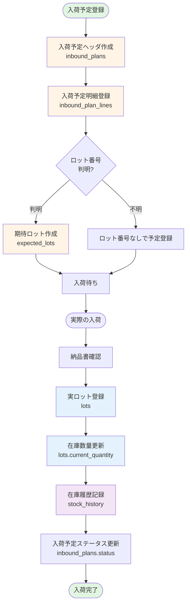
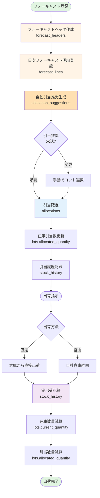
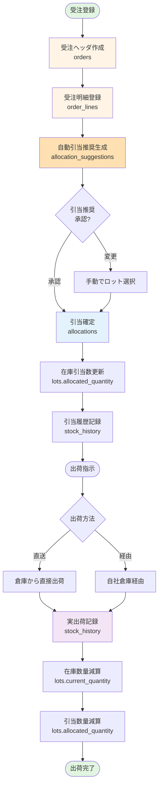
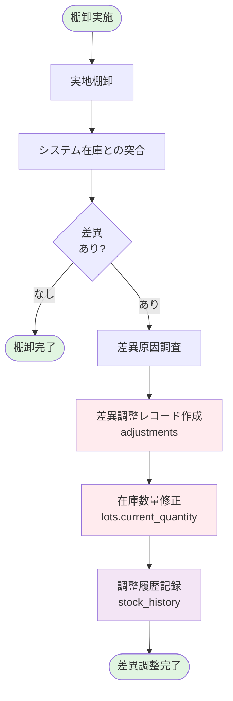

# ロット管理システム 概要設計書 (v2.2)

## 改訂履歴

| バージョン | 日付 | 変更内容 | 作成者 |
|-----------|------|---------|--------|
| v1.0 | 2024-11-14 | 初版作成 | 和也 + AI |
| v2.0 | 2024-11-14 | テーブル構造見直し | 和也 + AI |
| v2.1 | 2024-11-15 | 10項目の修正反映 | 和也 + AI |
| v2.2 | 2024-11-15 | 運用系テーブル追加 | 和也 + AI |

## v2.2での主な追加内容

- ユーザー・認証系テーブル(users, roles, user_roles)
- 運用系テーブル(batch_jobs, operation_logs)
- システム設定テーブル(business_rules, system_configs)
- マスタメンテナンス履歴テーブル(master_change_logs)

---

## 1. 背景・目的

ロット管理システムは、製品や部品をロット(同一条件で製造・出荷された最小単位)ごとに管理し、在庫や履歴を正確に把握するためのシステムです。ロット単位で管理することで在庫管理や工程管理の効率化、余剰在庫の削減が可能となり、品質問題発生時の原因究明や迅速な製品回収(リコール)を容易にします。また、製造から出荷までの履歴をロット別に残すことで、トレーサビリティ(追跡可能性)の強化にもつながります。

本概要設計書では、理想的な業務フローとデータ構造に基づき、ロット管理システムの設計方針と概要を示します。システム導入の目的は、在庫の正確性向上と業務効率化、コスト削減、そしてロット単位での正確な在庫把握と履歴管理による品質保証・法令遵守の強化です。

---

## 2. 業務の前提(方針)

本システムの業務設計における基本方針は以下の通りです:

### 2.1 入庫はロット単位で厳密管理

入荷時には必ずロット単位で在庫登録を行います。仕入先や生産ロットごとにロット番号を付与し、混合作業は避けます。これによりロットごとの数量・履歴を明確に管理します。

### 2.2 出庫は現物優先

出荷指示や引当はシステム上で行いますが、最終的な出庫処理では現場の実物を優先します。つまり、倉庫担当者が実際にピッキングしたロットと数量を実績として記録し、システム上の予定との差異は許容して後で調整します(※詳細は棚卸・差異調整にて吸収)。

### 2.3 入荷予定と実ロットの分離

購買発注や入荷予定(`inbound_plans`テーブル)と、実際に受け入れたロット在庫(`lots`テーブル)はデータ上分離しています。予定数量と実入庫数量の差異が生じても両者を直接上書きせず、予定は予定、実績は実績として管理します。入荷後に予定レコードのステータス更新や差異記録を行い、トレーサビリティを確保します。

### 2.4 引当予約と出荷実績の分離

受注に対する在庫の確保(引当、`allocations`テーブル)と、実際の出荷結果(出荷実績履歴)は分離管理します。引当は将来の出荷の予約情報であり、出荷時には実際に出庫されたロット・数量を実績として記録し、引当は消し込みます。この分離により、出荷当日のピッキング差異やロット変更にも対応しやすくなります。

### 2.5 棚卸と差異調整による在庫精度維持

日々の入出庫では多少の記録ずれやロスが発生する可能性を踏まえ、定期的に棚卸を実施しシステム在庫との差異を検出します。検出した差異は`adjustments`テーブルで調整記録を行い、在庫数量を是正します。これにより、帳簿在庫と実在庫を定期的に突合・修正し、月次で在庫精度をリセットする運用としています。

以上の方針に基づき、本システムは「ロット単位の正確な在庫管理」と「現場実態との柔軟な整合」を両立させる設計となっています。

---

## 3. 業務フロー

### 3.1 入荷業務フロー



### 3.2 受注・引当業務フロー(フォーキャストベース)



### 3.3 受注・引当業務フロー(受注ベース)



### 3.4 棚卸・差異調整フロー



---

## 4. ER図 (エンティティ関係図)

### 4.1 全体構成

```mermaid
erDiagram
    %% ================================================================
    %% マスタ系
    %% ================================================================
    customers {
        bigint customer_id PK
        string customer_code
        string customer_name
        timestamp created_at
        timestamp updated_at
    }

    delivery_places {
        bigint delivery_place_id PK
        string jiku_code
        string delivery_place_code
        string delivery_place_name
        bigint customer_id FK
        timestamp created_at
        timestamp updated_at
    }

    warehouses {
        bigint warehouse_id PK
        string warehouse_code
        string warehouse_name
        string warehouse_type
        timestamp created_at
        timestamp updated_at
    }

    products {
        bigint product_id PK
        string maker_part_code
        string product_name
        string base_unit
        int consumption_limit_days
        timestamp created_at
        timestamp updated_at
    }

    suppliers {
        bigint supplier_id PK
        string supplier_code
        string supplier_name
        timestamp created_at
        timestamp updated_at
    }

    %% ================================================================
    %% 品番マッピング系
    %% ================================================================
    customer_items {
        bigint customer_id FK
        string external_product_code
        bigint product_id FK
        bigint supplier_id FK
        string base_unit
        string pack_unit
        int pack_quantity
        string special_instructions
        timestamp created_at
        timestamp updated_at
    }

    %% ================================================================
    %% 入荷・在庫系
    %% ================================================================
    inbound_plans {
        bigint inbound_plan_id PK
        string plan_number
        bigint supplier_id FK
        date planned_arrival_date
        string status
        string notes
        timestamp created_at
        timestamp updated_at
    }

    inbound_plan_lines {
        bigint inbound_plan_line_id PK
        bigint inbound_plan_id FK
        bigint product_id FK
        decimal planned_quantity
        string unit
        timestamp created_at
        timestamp updated_at
    }

    expected_lots {
        bigint expected_lot_id PK
        bigint inbound_plan_line_id FK
        string expected_lot_number
        decimal expected_quantity
        date expected_expiry_date
        timestamp created_at
        timestamp updated_at
    }

    lots {
        bigint lot_id PK
        string lot_number
        bigint product_id FK
        bigint warehouse_id FK
        bigint supplier_id FK
        bigint expected_lot_id FK
        date received_date
        date expiry_date
        decimal current_quantity
        decimal allocated_quantity
        string unit
        string status
        timestamp created_at
        timestamp updated_at
    }

    %% ================================================================
    %% フォーキャスト系
    %% ================================================================
    forecast_headers {
        bigint forecast_id PK
        bigint customer_id FK
        bigint delivery_place_id FK
        string forecast_number
        date forecast_start_date
        date forecast_end_date
        string status
        timestamp created_at
        timestamp updated_at
    }

    forecast_lines {
        bigint forecast_line_id PK
        bigint forecast_id FK
        bigint product_id FK
        date delivery_date
        decimal forecast_quantity
        string unit
        timestamp created_at
        timestamp updated_at
    }

    %% ================================================================
    %% 受注・引当系
    %% ================================================================
    orders {
        bigint order_id PK
        string order_number
        bigint customer_id FK
        bigint delivery_place_id FK
        date order_date
        string status
        timestamp created_at
        timestamp updated_at
    }

    order_lines {
        bigint order_line_id PK
        bigint order_id FK
        bigint product_id FK
        date delivery_date
        decimal order_quantity
        string unit
        timestamp created_at
        timestamp updated_at
    }

    allocation_suggestions {
        bigint suggestion_id PK
        bigint forecast_line_id FK
        bigint lot_id FK
        decimal suggested_quantity
        string allocation_logic
        timestamp created_at
        timestamp updated_at
    }

    allocations {
        bigint allocation_id PK
        bigint order_line_id FK
        bigint lot_id FK
        decimal allocated_quantity
        string status
        timestamp created_at
        timestamp updated_at
    }

    %% ================================================================
    %% 在庫抽象化・履歴系
    %% ================================================================
    inventory_items {
        bigint inventory_item_id PK
        bigint product_id FK
        bigint warehouse_id FK
        decimal total_quantity
        decimal allocated_quantity
        decimal available_quantity
        timestamp last_updated
    }

    stock_history {
        bigint history_id PK
        bigint lot_id FK
        string transaction_type
        decimal quantity_change
        decimal quantity_after
        string reference_type
        bigint reference_id
        timestamp transaction_date
    }

    adjustments {
        bigint adjustment_id PK
        bigint lot_id FK
        string adjustment_type
        decimal adjusted_quantity
        string reason
        bigint adjusted_by FK
        timestamp adjusted_at
    }

    %% ================================================================
    %% ユーザー・認証系 (v2.2追加)
    %% ================================================================
    users {
        bigint user_id PK
        string username
        string email
        string password_hash
        string display_name
        boolean is_active
        timestamp last_login_at
        timestamp created_at
        timestamp updated_at
    }

    roles {
        bigint role_id PK
        string role_code
        string role_name
        string description
        timestamp created_at
        timestamp updated_at
    }

    user_roles {
        bigint user_id FK
        bigint role_id FK
        timestamp assigned_at
    }

    %% ================================================================
    %% 運用系 (v2.2追加)
    %% ================================================================
    batch_jobs {
        bigint job_id PK
        string job_name
        string job_type
        string status
        jsonb parameters
        text result_message
        timestamp started_at
        timestamp completed_at
        timestamp created_at
    }

    operation_logs {
        bigint log_id PK
        bigint user_id FK
        string operation_type
        string target_table
        bigint target_id
        jsonb changes
        string ip_address
        timestamp created_at
    }

    business_rules {
        bigint rule_id PK
        string rule_code
        string rule_name
        string rule_type
        jsonb rule_parameters
        boolean is_active
        timestamp created_at
        timestamp updated_at
    }

    system_configs {
        bigint config_id PK
        string config_key
        string config_value
        string description
        timestamp created_at
        timestamp updated_at
    }

    master_change_logs {
        bigint change_log_id PK
        string table_name
        bigint record_id
        string change_type
        jsonb old_values
        jsonb new_values
        bigint changed_by FK
        timestamp changed_at
    }

    %% ================================================================
    %% リレーション
    %% ================================================================
    
    %% マスタ系
    delivery_places ||--o{ customers : "belongs_to"
    
    %% 品番マッピング
    customer_items }o--|| customers : "for"
    customer_items }o--|| products : "maps_to"
    customer_items }o--|| suppliers : "supplied_by"
    
    %% 入荷系
    inbound_plans ||--|{ inbound_plan_lines : "has"
    inbound_plans }o--|| suppliers : "from"
    inbound_plan_lines }o--|| products : "contains"
    inbound_plan_lines ||--o{ expected_lots : "expects"
    
    %% 在庫系
    lots }o--|| products : "is_a"
    lots }o--|| warehouses : "stored_in"
    lots }o--|| suppliers : "from"
    lots }o--o| expected_lots : "actualized_from"
    
    %% フォーキャスト系
    forecast_headers ||--|{ forecast_lines : "has"
    forecast_headers }o--|| customers : "for"
    forecast_headers }o--|| delivery_places : "delivers_to"
    forecast_lines }o--|| products : "contains"
    forecast_lines ||--o{ allocation_suggestions : "generates"
    
    %% 受注系
    orders ||--|{ order_lines : "has"
    orders }o--|| customers : "from"
    orders }o--|| delivery_places : "delivers_to"
    order_lines }o--|| products : "contains"
    order_lines ||--o{ allocations : "allocated_via"
    
    %% 引当系
    allocation_suggestions }o--|| lots : "suggests"
    allocations }o--|| lots : "picks_from"
    
    %% 在庫抽象化
    inventory_items }o--|| products : "summarizes"
    inventory_items }o--|| warehouses : "in"
    
    %% 履歴系
    stock_history }o--|| lots : "logs"
    adjustments }o--|| lots : "adjusts"
    adjustments }o--|| users : "adjusted_by"
    
    %% ユーザー・認証系
    users ||--o{ user_roles : "has"
    roles ||--o{ user_roles : "assigned_to"
    
    %% 運用系
    operation_logs }o--|| users : "performed_by"
    master_change_logs }o--|| users : "changed_by"
```



---

## 5. テーブル定義

### 5.1 マスタ系テーブル

#### 5.1.1 customers (得意先マスタ)

| カラム名 | 型 | NULL | デフォルト | 説明 |
|---------|-----|------|-----------|------|
| customer_id | BIGINT | NOT NULL | AUTO | 得意先ID(PK) |
| customer_code | VARCHAR(50) | NOT NULL | - | 得意先コード(UK) |
| customer_name | VARCHAR(200) | NOT NULL | - | 得意先名 |
| created_at | TIMESTAMP | NOT NULL | CURRENT_TIMESTAMP | 作成日時 |
| updated_at | TIMESTAMP | NOT NULL | CURRENT_TIMESTAMP | 更新日時 |

**制約:**
- PRIMARY KEY (customer_id)
- UNIQUE (customer_code)

---

#### 5.1.2 delivery_places (納入先マスタ)

| カラム名 | 型 | NULL | デフォルト | 説明 |
|---------|-----|------|-----------|------|
| delivery_place_id | BIGINT | NOT NULL | AUTO | 納入先ID(PK) |
| jiku_code | VARCHAR(50) | NULL | - | 次区コード(SAP連携用) |
| delivery_place_code | VARCHAR(50) | NOT NULL | - | 納入先コード(表示用) |
| delivery_place_name | VARCHAR(200) | NOT NULL | - | 納入先名 |
| customer_id | BIGINT | NOT NULL | - | 得意先ID(FK) |
| created_at | TIMESTAMP | NOT NULL | CURRENT_TIMESTAMP | 作成日時 |
| updated_at | TIMESTAMP | NOT NULL | CURRENT_TIMESTAMP | 更新日時 |

**制約:**
- PRIMARY KEY (delivery_place_id)
- FOREIGN KEY (customer_id) REFERENCES customers(customer_id)
- UNIQUE (delivery_place_code)

---

#### 5.1.3 warehouses (倉庫マスタ)

| カラム名 | 型 | NULL | デフォルト | 説明 |
|---------|-----|------|-----------|------|
| warehouse_id | BIGINT | NOT NULL | AUTO | 倉庫ID(PK) |
| warehouse_code | VARCHAR(50) | NOT NULL | - | 倉庫コード(UK) |
| warehouse_name | VARCHAR(200) | NOT NULL | - | 倉庫名 |
| warehouse_type | VARCHAR(20) | NOT NULL | - | 倉庫種別(internal/external/supplier) |
| created_at | TIMESTAMP | NOT NULL | CURRENT_TIMESTAMP | 作成日時 |
| updated_at | TIMESTAMP | NOT NULL | CURRENT_TIMESTAMP | 更新日時 |

**制約:**
- PRIMARY KEY (warehouse_id)
- UNIQUE (warehouse_code)
- CHECK (warehouse_type IN ('internal', 'external', 'supplier'))

---

#### 5.1.4 products (製品マスタ)

| カラム名 | 型 | NULL | デフォルト | 説明 |
|---------|-----|------|-----------|------|
| product_id | BIGINT | NOT NULL | AUTO | 製品ID(PK) |
| maker_part_code | VARCHAR(100) | NOT NULL | - | メーカー品番(UK) |
| product_name | VARCHAR(200) | NOT NULL | - | 製品名 |
| base_unit | VARCHAR(20) | NOT NULL | - | 社内在庫単位(個/箱/kg等) |
| consumption_limit_days | INT | NULL | - | 消費期限日数 |
| created_at | TIMESTAMP | NOT NULL | CURRENT_TIMESTAMP | 作成日時 |
| updated_at | TIMESTAMP | NOT NULL | CURRENT_TIMESTAMP | 更新日時 |

**制約:**
- PRIMARY KEY (product_id)
- UNIQUE (maker_part_code)

---

#### 5.1.5 suppliers (仕入先マスタ)

| カラム名 | 型 | NULL | デフォルト | 説明 |
|---------|-----|------|-----------|------|
| supplier_id | BIGINT | NOT NULL | AUTO | 仕入先ID(PK) |
| supplier_code | VARCHAR(50) | NOT NULL | - | 仕入先コード(UK) |
| supplier_name | VARCHAR(200) | NOT NULL | - | 仕入先名 |
| created_at | TIMESTAMP | NOT NULL | CURRENT_TIMESTAMP | 作成日時 |
| updated_at | TIMESTAMP | NOT NULL | CURRENT_TIMESTAMP | 更新日時 |

**制約:**
- PRIMARY KEY (supplier_id)
- UNIQUE (supplier_code)

---

### 5.2 品番マッピング系テーブル

#### 5.2.1 customer_items (得意先品番マッピング)

| カラム名 | 型 | NULL | デフォルト | 説明 |
|---------|-----|------|-----------|------|
| customer_id | BIGINT | NOT NULL | - | 得意先ID(PK, FK) |
| external_product_code | VARCHAR(100) | NOT NULL | - | 先方品番(PK) |
| product_id | BIGINT | NOT NULL | - | メーカー品番ID(FK) |
| supplier_id | BIGINT | NULL | - | 仕入先ID(FK) |
| base_unit | VARCHAR(20) | NOT NULL | - | 社内在庫単位 |
| pack_unit | VARCHAR(20) | NULL | - | 荷姿単位 |
| pack_quantity | INT | NULL | - | 荷姿数量 |
| special_instructions | TEXT | NULL | - | 特記事項 |
| created_at | TIMESTAMP | NOT NULL | CURRENT_TIMESTAMP | 作成日時 |
| updated_at | TIMESTAMP | NOT NULL | CURRENT_TIMESTAMP | 更新日時 |

**制約:**
- PRIMARY KEY (customer_id, external_product_code)
- FOREIGN KEY (customer_id) REFERENCES customers(customer_id)
- FOREIGN KEY (product_id) REFERENCES products(product_id)
- FOREIGN KEY (supplier_id) REFERENCES suppliers(supplier_id)

---

### 5.3 入荷・在庫系テーブル

#### 5.3.1 inbound_plans (入荷予定ヘッダ)

| カラム名 | 型 | NULL | デフォルト | 説明 |
|---------|-----|------|-----------|------|
| inbound_plan_id | BIGINT | NOT NULL | AUTO | 入荷予定ID(PK) |
| plan_number | VARCHAR(50) | NOT NULL | - | 入荷予定番号(UK) |
| supplier_id | BIGINT | NOT NULL | - | 仕入先ID(FK) |
| planned_arrival_date | DATE | NOT NULL | - | 入荷予定日 |
| status | VARCHAR(20) | NOT NULL | 'planned' | ステータス |
| notes | TEXT | NULL | - | 備考 |
| created_at | TIMESTAMP | NOT NULL | CURRENT_TIMESTAMP | 作成日時 |
| updated_at | TIMESTAMP | NOT NULL | CURRENT_TIMESTAMP | 更新日時 |

**制約:**
- PRIMARY KEY (inbound_plan_id)
- UNIQUE (plan_number)
- FOREIGN KEY (supplier_id) REFERENCES suppliers(supplier_id)
- CHECK (status IN ('planned', 'partially_received', 'received', 'cancelled'))

---

#### 5.3.2 inbound_plan_lines (入荷予定明細)

| カラム名 | 型 | NULL | デフォルト | 説明 |
|---------|-----|------|-----------|------|
| inbound_plan_line_id | BIGINT | NOT NULL | AUTO | 入荷予定明細ID(PK) |
| inbound_plan_id | BIGINT | NOT NULL | - | 入荷予定ID(FK) |
| product_id | BIGINT | NOT NULL | - | 製品ID(FK) |
| planned_quantity | DECIMAL(15,3) | NOT NULL | - | 予定数量 |
| unit | VARCHAR(20) | NOT NULL | - | 単位 |
| created_at | TIMESTAMP | NOT NULL | CURRENT_TIMESTAMP | 作成日時 |
| updated_at | TIMESTAMP | NOT NULL | CURRENT_TIMESTAMP | 更新日時 |

**制約:**
- PRIMARY KEY (inbound_plan_line_id)
- FOREIGN KEY (inbound_plan_id) REFERENCES inbound_plans(inbound_plan_id)
- FOREIGN KEY (product_id) REFERENCES products(product_id)

---

#### 5.3.3 expected_lots (期待ロット)

| カラム名 | 型 | NULL | デフォルト | 説明 |
|---------|-----|------|-----------|------|
| expected_lot_id | BIGINT | NOT NULL | AUTO | 期待ロットID(PK) |
| inbound_plan_line_id | BIGINT | NOT NULL | - | 入荷予定明細ID(FK) |
| expected_lot_number | VARCHAR(100) | NULL | - | 期待ロット番号 |
| expected_quantity | DECIMAL(15,3) | NOT NULL | - | 期待数量 |
| expected_expiry_date | DATE | NULL | - | 期待消費期限 |
| created_at | TIMESTAMP | NOT NULL | CURRENT_TIMESTAMP | 作成日時 |
| updated_at | TIMESTAMP | NOT NULL | CURRENT_TIMESTAMP | 更新日時 |

**制約:**
- PRIMARY KEY (expected_lot_id)
- FOREIGN KEY (inbound_plan_line_id) REFERENCES inbound_plan_lines(inbound_plan_line_id)

---

#### 5.3.4 lots (ロット在庫)

| カラム名 | 型 | NULL | デフォルト | 説明 |
|---------|-----|------|-----------|------|
| lot_id | BIGINT | NOT NULL | AUTO | ロットID(PK) |
| lot_number | VARCHAR(100) | NOT NULL | - | ロット番号 |
| product_id | BIGINT | NOT NULL | - | 製品ID(FK) |
| warehouse_id | BIGINT | NOT NULL | - | 倉庫ID(FK) |
| supplier_id | BIGINT | NULL | - | 仕入先ID(FK) |
| expected_lot_id | BIGINT | NULL | - | 期待ロットID(FK) |
| received_date | DATE | NOT NULL | - | 入荷日 |
| expiry_date | DATE | NULL | - | 消費期限 |
| current_quantity | DECIMAL(15,3) | NOT NULL | 0 | 現在庫数 |
| allocated_quantity | DECIMAL(15,3) | NOT NULL | 0 | 引当済数量 |
| unit | VARCHAR(20) | NOT NULL | - | 単位 |
| status | VARCHAR(20) | NOT NULL | 'active' | ステータス |
| created_at | TIMESTAMP | NOT NULL | CURRENT_TIMESTAMP | 作成日時 |
| updated_at | TIMESTAMP | NOT NULL | CURRENT_TIMESTAMP | 更新日時 |

**制約:**
- PRIMARY KEY (lot_id)
- FOREIGN KEY (product_id) REFERENCES products(product_id)
- FOREIGN KEY (warehouse_id) REFERENCES warehouses(warehouse_id)
- FOREIGN KEY (supplier_id) REFERENCES suppliers(supplier_id)
- FOREIGN KEY (expected_lot_id) REFERENCES expected_lots(expected_lot_id)
- UNIQUE (lot_number, product_id, warehouse_id)
- CHECK (status IN ('active', 'depleted', 'expired', 'quarantine'))
- CHECK (current_quantity >= 0)
- CHECK (allocated_quantity >= 0)
- CHECK (allocated_quantity <= current_quantity)

---

### 5.4 フォーキャスト系テーブル

#### 5.4.1 forecast_headers (フォーキャストヘッダ)

| カラム名 | 型 | NULL | デフォルト | 説明 |
|---------|-----|------|-----------|------|
| forecast_id | BIGINT | NOT NULL | AUTO | フォーキャストID(PK) |
| customer_id | BIGINT | NOT NULL | - | 得意先ID(FK) |
| delivery_place_id | BIGINT | NOT NULL | - | 納入先ID(FK) |
| forecast_number | VARCHAR(50) | NOT NULL | - | フォーキャスト番号(UK) |
| forecast_start_date | DATE | NOT NULL | - | フォーキャスト開始日 |
| forecast_end_date | DATE | NOT NULL | - | フォーキャスト終了日 |
| status | VARCHAR(20) | NOT NULL | 'active' | ステータス |
| created_at | TIMESTAMP | NOT NULL | CURRENT_TIMESTAMP | 作成日時 |
| updated_at | TIMESTAMP | NOT NULL | CURRENT_TIMESTAMP | 更新日時 |

**制約:**
- PRIMARY KEY (forecast_id)
- UNIQUE (forecast_number)
- FOREIGN KEY (customer_id) REFERENCES customers(customer_id)
- FOREIGN KEY (delivery_place_id) REFERENCES delivery_places(delivery_place_id)
- CHECK (status IN ('active', 'completed', 'cancelled'))

---

#### 5.4.2 forecast_lines (フォーキャスト明細)

| カラム名 | 型 | NULL | デフォルト | 説明 |
|---------|-----|------|-----------|------|
| forecast_line_id | BIGINT | NOT NULL | AUTO | フォーキャスト明細ID(PK) |
| forecast_id | BIGINT | NOT NULL | - | フォーキャストID(FK) |
| product_id | BIGINT | NOT NULL | - | 製品ID(FK) |
| delivery_date | DATE | NOT NULL | - | 納入日 |
| forecast_quantity | DECIMAL(15,3) | NOT NULL | - | フォーキャスト数量 |
| unit | VARCHAR(20) | NOT NULL | - | 単位 |
| created_at | TIMESTAMP | NOT NULL | CURRENT_TIMESTAMP | 作成日時 |
| updated_at | TIMESTAMP | NOT NULL | CURRENT_TIMESTAMP | 更新日時 |

**制約:**
- PRIMARY KEY (forecast_line_id)
- FOREIGN KEY (forecast_id) REFERENCES forecast_headers(forecast_id)
- FOREIGN KEY (product_id) REFERENCES products(product_id)

---

### 5.5 受注・引当系テーブル

#### 5.5.1 orders (受注ヘッダ)

| カラム名 | 型 | NULL | デフォルト | 説明 |
|---------|-----|------|-----------|------|
| order_id | BIGINT | NOT NULL | AUTO | 受注ID(PK) |
| order_number | VARCHAR(50) | NOT NULL | - | 受注番号(UK) |
| customer_id | BIGINT | NOT NULL | - | 得意先ID(FK) |
| delivery_place_id | BIGINT | NOT NULL | - | 納入先ID(FK) |
| order_date | DATE | NOT NULL | - | 受注日 |
| status | VARCHAR(20) | NOT NULL | 'pending' | ステータス |
| created_at | TIMESTAMP | NOT NULL | CURRENT_TIMESTAMP | 作成日時 |
| updated_at | TIMESTAMP | NOT NULL | CURRENT_TIMESTAMP | 更新日時 |

**制約:**
- PRIMARY KEY (order_id)
- UNIQUE (order_number)
- FOREIGN KEY (customer_id) REFERENCES customers(customer_id)
- FOREIGN KEY (delivery_place_id) REFERENCES delivery_places(delivery_place_id)
- CHECK (status IN ('pending', 'allocated', 'shipped', 'completed', 'cancelled'))

---

#### 5.5.2 order_lines (受注明細)

| カラム名 | 型 | NULL | デフォルト | 説明 |
|---------|-----|------|-----------|------|
| order_line_id | BIGINT | NOT NULL | AUTO | 受注明細ID(PK) |
| order_id | BIGINT | NOT NULL | - | 受注ID(FK) |
| product_id | BIGINT | NOT NULL | - | 製品ID(FK) |
| delivery_date | DATE | NOT NULL | - | 納入日 |
| order_quantity | DECIMAL(15,3) | NOT NULL | - | 受注数量 |
| unit | VARCHAR(20) | NOT NULL | - | 単位 |
| created_at | TIMESTAMP | NOT NULL | CURRENT_TIMESTAMP | 作成日時 |
| updated_at | TIMESTAMP | NOT NULL | CURRENT_TIMESTAMP | 更新日時 |

**制約:**
- PRIMARY KEY (order_line_id)
- FOREIGN KEY (order_id) REFERENCES orders(order_id)
- FOREIGN KEY (product_id) REFERENCES products(product_id)

---

#### 5.5.3 allocation_suggestions (引当推奨)

| カラム名 | 型 | NULL | デフォルト | 説明 |
|---------|-----|------|-----------|------|
| suggestion_id | BIGINT | NOT NULL | AUTO | 推奨ID(PK) |
| forecast_line_id | BIGINT | NOT NULL | - | フォーキャスト明細ID(FK) |
| lot_id | BIGINT | NOT NULL | - | ロットID(FK) |
| suggested_quantity | DECIMAL(15,3) | NOT NULL | - | 推奨数量 |
| allocation_logic | VARCHAR(50) | NOT NULL | - | 引当ロジック |
| created_at | TIMESTAMP | NOT NULL | CURRENT_TIMESTAMP | 作成日時 |
| updated_at | TIMESTAMP | NOT NULL | CURRENT_TIMESTAMP | 更新日時 |

**制約:**
- PRIMARY KEY (suggestion_id)
- FOREIGN KEY (forecast_line_id) REFERENCES forecast_lines(forecast_line_id)
- FOREIGN KEY (lot_id) REFERENCES lots(lot_id)

**注記:**
- `allocation_logic`には 'FEFO', 'FIFO', 'MANUAL' 等の値が入る

---

#### 5.5.4 allocations (引当実績)

| カラム名 | 型 | NULL | デフォルト | 説明 |
|---------|-----|------|-----------|------|
| allocation_id | BIGINT | NOT NULL | AUTO | 引当ID(PK) |
| order_line_id | BIGINT | NOT NULL | - | 受注明細ID(FK) |
| lot_id | BIGINT | NOT NULL | - | ロットID(FK) |
| allocated_quantity | DECIMAL(15,3) | NOT NULL | - | 引当数量 |
| status | VARCHAR(20) | NOT NULL | 'allocated' | ステータス |
| created_at | TIMESTAMP | NOT NULL | CURRENT_TIMESTAMP | 作成日時 |
| updated_at | TIMESTAMP | NOT NULL | CURRENT_TIMESTAMP | 更新日時 |

**制約:**
- PRIMARY KEY (allocation_id)
- FOREIGN KEY (order_line_id) REFERENCES order_lines(order_line_id)
- FOREIGN KEY (lot_id) REFERENCES lots(lot_id)
- CHECK (status IN ('allocated', 'shipped', 'cancelled'))

---

### 5.6 在庫抽象化・履歴系テーブル

#### 5.6.1 inventory_items (在庫サマリ)

| カラム名 | 型 | NULL | デフォルト | 説明 |
|---------|-----|------|-----------|------|
| inventory_item_id | BIGINT | NOT NULL | AUTO | 在庫アイテムID(PK) |
| product_id | BIGINT | NOT NULL | - | 製品ID(FK) |
| warehouse_id | BIGINT | NOT NULL | - | 倉庫ID(FK) |
| total_quantity | DECIMAL(15,3) | NOT NULL | 0 | 合計在庫数 |
| allocated_quantity | DECIMAL(15,3) | NOT NULL | 0 | 引当済数量 |
| available_quantity | DECIMAL(15,3) | NOT NULL | 0 | 引当可能数量 |
| last_updated | TIMESTAMP | NOT NULL | CURRENT_TIMESTAMP | 最終更新日時 |

**制約:**
- PRIMARY KEY (inventory_item_id)
- FOREIGN KEY (product_id) REFERENCES products(product_id)
- FOREIGN KEY (warehouse_id) REFERENCES warehouses(warehouse_id)
- UNIQUE (product_id, warehouse_id)

**注記:**
- このテーブルはトリガーで自動生成・同期される

---

#### 5.6.2 stock_history (在庫履歴)

| カラム名 | 型 | NULL | デフォルト | 説明 |
|---------|-----|------|-----------|------|
| history_id | BIGINT | NOT NULL | AUTO | 履歴ID(PK) |
| lot_id | BIGINT | NOT NULL | - | ロットID(FK) |
| transaction_type | VARCHAR(20) | NOT NULL | - | トランザクション種別 |
| quantity_change | DECIMAL(15,3) | NOT NULL | - | 数量変動 |
| quantity_after | DECIMAL(15,3) | NOT NULL | - | 変動後数量 |
| reference_type | VARCHAR(50) | NULL | - | 参照元種別 |
| reference_id | BIGINT | NULL | - | 参照元ID |
| transaction_date | TIMESTAMP | NOT NULL | CURRENT_TIMESTAMP | トランザクション日時 |

**制約:**
- PRIMARY KEY (history_id)
- FOREIGN KEY (lot_id) REFERENCES lots(lot_id)
- CHECK (transaction_type IN ('inbound', 'allocation', 'shipment', 'adjustment', 'return'))

---

#### 5.6.3 adjustments (在庫調整)

| カラム名 | 型 | NULL | デフォルト | 説明 |
|---------|-----|------|-----------|------|
| adjustment_id | BIGINT | NOT NULL | AUTO | 調整ID(PK) |
| lot_id | BIGINT | NOT NULL | - | ロットID(FK) |
| adjustment_type | VARCHAR(20) | NOT NULL | - | 調整種別 |
| adjusted_quantity | DECIMAL(15,3) | NOT NULL | - | 調整数量 |
| reason | TEXT | NOT NULL | - | 調整理由 |
| adjusted_by | BIGINT | NOT NULL | - | 調整者(FK) |
| adjusted_at | TIMESTAMP | NOT NULL | CURRENT_TIMESTAMP | 調整日時 |

**制約:**
- PRIMARY KEY (adjustment_id)
- FOREIGN KEY (lot_id) REFERENCES lots(lot_id)
- FOREIGN KEY (adjusted_by) REFERENCES users(user_id)
- CHECK (adjustment_type IN ('physical_count', 'damage', 'loss', 'found', 'other'))

---

### 5.7 ユーザー・認証系テーブル (v2.2追加)

#### 5.7.1 users (ユーザー)

| カラム名 | 型 | NULL | デフォルト | 説明 |
|---------|-----|------|-----------|------|
| user_id | BIGINT | NOT NULL | AUTO | ユーザーID(PK) |
| username | VARCHAR(50) | NOT NULL | - | ユーザー名(UK) |
| email | VARCHAR(255) | NOT NULL | - | メールアドレス(UK) |
| password_hash | VARCHAR(255) | NOT NULL | - | パスワードハッシュ |
| display_name | VARCHAR(100) | NOT NULL | - | 表示名 |
| is_active | BOOLEAN | NOT NULL | TRUE | 有効フラグ |
| last_login_at | TIMESTAMP | NULL | - | 最終ログイン日時 |
| created_at | TIMESTAMP | NOT NULL | CURRENT_TIMESTAMP | 作成日時 |
| updated_at | TIMESTAMP | NOT NULL | CURRENT_TIMESTAMP | 更新日時 |

**制約:**
- PRIMARY KEY (user_id)
- UNIQUE (username)
- UNIQUE (email)

---

#### 5.7.2 roles (ロール)

| カラム名 | 型 | NULL | デフォルト | 説明 |
|---------|-----|------|-----------|------|
| role_id | BIGINT | NOT NULL | AUTO | ロールID(PK) |
| role_code | VARCHAR(50) | NOT NULL | - | ロールコード(UK) |
| role_name | VARCHAR(100) | NOT NULL | - | ロール名 |
| description | TEXT | NULL | - | 説明 |
| created_at | TIMESTAMP | NOT NULL | CURRENT_TIMESTAMP | 作成日時 |
| updated_at | TIMESTAMP | NOT NULL | CURRENT_TIMESTAMP | 更新日時 |

**制約:**
- PRIMARY KEY (role_id)
- UNIQUE (role_code)

**初期データ例:**
- admin: 管理者
- planner: 計画担当者
- warehouse: 倉庫担当者
- viewer: 閲覧専用

---

#### 5.7.3 user_roles (ユーザーロール)

| カラム名 | 型 | NULL | デフォルト | 説明 |
|---------|-----|------|-----------|------|
| user_id | BIGINT | NOT NULL | - | ユーザーID(PK, FK) |
| role_id | BIGINT | NOT NULL | - | ロールID(PK, FK) |
| assigned_at | TIMESTAMP | NOT NULL | CURRENT_TIMESTAMP | 割当日時 |

**制約:**
- PRIMARY KEY (user_id, role_id)
- FOREIGN KEY (user_id) REFERENCES users(user_id)
- FOREIGN KEY (role_id) REFERENCES roles(role_id)

---

### 5.8 運用系テーブル (v2.2追加)

#### 5.8.1 batch_jobs (バッチジョブ)

| カラム名 | 型 | NULL | デフォルト | 説明 |
|---------|-----|------|-----------|------|
| job_id | BIGINT | NOT NULL | AUTO | ジョブID(PK) |
| job_name | VARCHAR(100) | NOT NULL | - | ジョブ名 |
| job_type | VARCHAR(50) | NOT NULL | - | ジョブ種別 |
| status | VARCHAR(20) | NOT NULL | 'pending' | ステータス |
| parameters | JSONB | NULL | - | ジョブパラメータ |
| result_message | TEXT | NULL | - | 実行結果メッセージ |
| started_at | TIMESTAMP | NULL | - | 開始日時 |
| completed_at | TIMESTAMP | NULL | - | 完了日時 |
| created_at | TIMESTAMP | NOT NULL | CURRENT_TIMESTAMP | 作成日時 |

**制約:**
- PRIMARY KEY (job_id)
- CHECK (status IN ('pending', 'running', 'completed', 'failed'))
- CHECK (job_type IN ('allocation_suggestion', 'inventory_sync', 'data_import', 'report_generation'))

---

#### 5.8.2 operation_logs (操作ログ)

| カラム名 | 型 | NULL | デフォルト | 説明 |
|---------|-----|------|-----------|------|
| log_id | BIGINT | NOT NULL | AUTO | ログID(PK) |
| user_id | BIGINT | NULL | - | ユーザーID(FK) |
| operation_type | VARCHAR(50) | NOT NULL | - | 操作種別 |
| target_table | VARCHAR(50) | NOT NULL | - | 対象テーブル |
| target_id | BIGINT | NULL | - | 対象レコードID |
| changes | JSONB | NULL | - | 変更内容 |
| ip_address | VARCHAR(50) | NULL | - | IPアドレス |
| created_at | TIMESTAMP | NOT NULL | CURRENT_TIMESTAMP | 作成日時 |

**制約:**
- PRIMARY KEY (log_id)
- FOREIGN KEY (user_id) REFERENCES users(user_id)
- CHECK (operation_type IN ('create', 'update', 'delete', 'login', 'logout', 'export'))

---

#### 5.8.3 business_rules (業務ルール)

| カラム名 | 型 | NULL | デフォルト | 説明 |
|---------|-----|------|-----------|------|
| rule_id | BIGINT | NOT NULL | AUTO | ルールID(PK) |
| rule_code | VARCHAR(50) | NOT NULL | - | ルールコード(UK) |
| rule_name | VARCHAR(100) | NOT NULL | - | ルール名 |
| rule_type | VARCHAR(50) | NOT NULL | - | ルール種別 |
| rule_parameters | JSONB | NOT NULL | - | ルールパラメータ |
| is_active | BOOLEAN | NOT NULL | TRUE | 有効フラグ |
| created_at | TIMESTAMP | NOT NULL | CURRENT_TIMESTAMP | 作成日時 |
| updated_at | TIMESTAMP | NOT NULL | CURRENT_TIMESTAMP | 更新日時 |

**制約:**
- PRIMARY KEY (rule_id)
- UNIQUE (rule_code)
- CHECK (rule_type IN ('allocation', 'expiry_warning', 'kanban', 'other'))

**ルール例:**
```json
{
  "rule_code": "FEFO_ALLOCATION",
  "rule_type": "allocation",
  "rule_parameters": {
    "logic": "FEFO",
    "warning_days_before_expiry": 7
  }
}
```

---

#### 5.8.4 system_configs (システム設定)

| カラム名 | 型 | NULL | デフォルト | 説明 |
|---------|-----|------|-----------|------|
| config_id | BIGINT | NOT NULL | AUTO | 設定ID(PK) |
| config_key | VARCHAR(100) | NOT NULL | - | 設定キー(UK) |
| config_value | TEXT | NOT NULL | - | 設定値 |
| description | TEXT | NULL | - | 説明 |
| created_at | TIMESTAMP | NOT NULL | CURRENT_TIMESTAMP | 作成日時 |
| updated_at | TIMESTAMP | NOT NULL | CURRENT_TIMESTAMP | 更新日時 |

**制約:**
- PRIMARY KEY (config_id)
- UNIQUE (config_key)

**設定例:**
- `expiry_warning_days`: 7
- `default_allocation_logic`: FEFO
- `inventory_sync_interval_minutes`: 60

---

#### 5.8.5 master_change_logs (マスタ変更履歴)

| カラム名 | 型 | NULL | デフォルト | 説明 |
|---------|-----|------|-----------|------|
| change_log_id | BIGINT | NOT NULL | AUTO | 変更ログID(PK) |
| table_name | VARCHAR(50) | NOT NULL | - | テーブル名 |
| record_id | BIGINT | NOT NULL | - | レコードID |
| change_type | VARCHAR(20) | NOT NULL | - | 変更種別 |
| old_values | JSONB | NULL | - | 変更前の値 |
| new_values | JSONB | NULL | - | 変更後の値 |
| changed_by | BIGINT | NOT NULL | - | 変更者(FK) |
| changed_at | TIMESTAMP | NOT NULL | CURRENT_TIMESTAMP | 変更日時 |

**制約:**
- PRIMARY KEY (change_log_id)
- FOREIGN KEY (changed_by) REFERENCES users(user_id)
- CHECK (change_type IN ('insert', 'update', 'delete'))

---

## 6. 運用上の想定

### 6.1 引当ロジック

**フォーキャスト明細に対して**、システムは以下のロジックで引当推奨を生成します:

1. **FEFO(First Expired, First Out)**: 消費期限が近いロットを優先
2. **FIFO(First In, First Out)**: 入荷日が古いロットを優先
3. **手動引当**: 倉庫担当者が任意のロットを選択

引当推奨は `allocation_suggestions` テーブルに保存されます。その後、受注確定時に受注明細(`order_lines`)が生成され、引当推奨を参考にして `allocations` テーブルへ確定レコードが作成されます。

**業務フロー:**
```
フォーキャスト登録
  ↓
引当推奨生成(allocation_suggestions) ← システムが提案
  ↓
受注確定・受注明細作成(order_lines)
  ↓
引当確定(allocations) ← 実際の引当
```

### 6.2 在庫同期

`inventory_items` テーブルは、`lots` テーブルの集計結果をトリガーで自動的に同期します。これにより、画面表示やAPI応答時に毎回集計クエリを発行する必要がなくなります。

### 6.3 トレーサビリティ

すべての在庫変動は `stock_history` テーブルに記録され、ロット単位での入荷から出荷までの履歴を追跡できます。

### 6.4 ユーザー権限管理

- `users` テーブル: ログイン認証に使用
- `roles` テーブル: 権限グループの定義
- `user_roles` テーブル: ユーザーへのロール割当

将来的にはロールごとの詳細な権限設定(permissions)を追加する可能性がありますが、v2.2ではロールベースのシンプルな権限管理を採用します。

### 6.5 監査証跡

- `operation_logs`: 画面・API操作の記録
- `master_change_logs`: マスタデータの変更履歴
- `adjustments`: 在庫調整の理由と承認者記録

これらにより、誰が・いつ・何を・なぜ変更したかを追跡できます。

---

## 7. 今後の課題・拡張

### 7.1 v2.2で未対応の機能

以下の機能はv3.0以降で検討します:

- **詳細な権限管理**: ロールごとの操作権限(permissions)テーブル
- **返品管理**: 返品ロット(`return_lots`)の管理
- **ロット分割**: 1つのロットを複数に分割する機能
- **複数倉庫間転送**: 倉庫間のロット移動履歴
- **API連携**: SAP/ERP等との自動連携インターフェース
- **通知機能**: 消費期限アラート、引当失敗通知等

### 7.2 パフォーマンス最適化

大量データを扱う場合、以下のインデックスやビューの追加を検討します:

- `lots(expiry_date)`: FEFO引当の高速化
- `lots(product_id, warehouse_id, status)`: 在庫検索の高速化
- マテリアライズドビュー: 複雑な集計クエリの事前計算

### 7.3 運用・保守

- 定期的なバッチジョブ(`batch_jobs`)の自動実行
- 古い履歴データのアーカイブ・削除ポリシー
- バックアップ・リストア手順の確立

---

## 8. まとめ

本概要設計書(v2.2)では、ロット管理システムの全体像を示しました。

**v2.2の特徴:**
- v2.1のコアテーブル構造を維持
- ユーザー認証・権限管理機能を追加
- 運用・監査に必要なテーブルを追加
- 段階的な実装を想定した設計

**次のステップ:**
1. DDL(CREATE TABLE文)の作成
2. トリガー・ビュー設計
3. 初期データ投入スクリプト作成
4. FastAPI/React側のモデル・スキーマ更新

この設計書を基に、実装チームは具体的な開発作業に着手できます。

---

**Document Version:** v2.2  
**Last Updated:** 2025-11-15  
**Author:** 和也 + AI  
**Status:** Draft - Ready for Development
